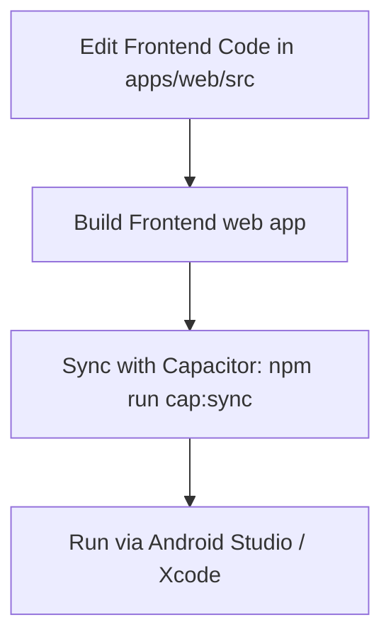

# Mobile Development Guide

This guide explains how to build, sync, and run your React frontend changes on a physical mobile device or simulator/emulator using Capacitor.

---

## The Workflow at a Glance

Every time you make a change in the frontend code (`apps/web/src/`), you must compile the React app and synchronize those files with the native mobile project before deploying it to your phone.



---

## Step-by-Step Instructions

### Step 1: Make your changes
Edit your React components, styling, or hooks in `apps/web/src/`.

### Step 2: Build the frontend web bundle
Depending on which backend API you want your mobile app to connect to, choose **one** of the following build commands to run from the **root directory**:

#### Option A: Connect to Production Backend (Railway)
*Use this when you want your mobile app to talk to the live backend server on the internet.*
```bash
npm run build:mobile
```
> **Backend URL set to:** `https://aquaflowserver-production.up.railway.app`

#### Option B: Connect to Local Backend (on the same Wi-Fi network)
*Use this when running the backend locally (`npm run dev:server`) and running the app on a physical mobile device.*
1. Find your computer's local IP address.
   - On Windows, open PowerShell/Command Prompt and run: `ipconfig`
   - Look for the **IPv4 Address** (e.g., `192.168.100.15`).
2. Verify or update the IP address in [apps/web/package.json](file:///c:/Users/muham/Desktop/work-storage/apna%20pani/apna-pani/apps/web/package.json#L8):
   ```json
   "build:mobile:local": "cross-env VITE_API_URL=http://<YOUR_IP>:5000 vite build"
   ```
3. Run the local build command from the root directory:
   ```bash
   npm run build:mobile:local
   ```
> **Important:** Your phone and computer MUST be connected to the exact same Wi-Fi network.

#### Option C: Connect to Android Emulator (Localhost)
*Use this only when running the app inside the Android Studio Emulator on the same computer.*
```bash
npm run build:mobile:emulator
```
> **Backend URL set to:** `http://10.0.2.2:5000` (the emulator's special loopback IP pointing to your computer's localhost).

---

### Step 3: Synchronize with Capacitor
Copy your newly built assets to the native Android and iOS platform projects by running:
```bash
npm run cap:sync
```

*(Tip: You can chain these commands together, for example: `npm run build:mobile && npm run cap:sync`)*

---

### Step 4: Run the App on Your Device

#### For Android (Android Studio):
1. **Open Android Studio** by running this command from the root:
   ```bash
   npm run cap:open:android
   ```
   *(Alternatively, open Android Studio manually and select the `apps/web/android` directory).*
2. Connect your physical Android phone using a USB cable. Ensure **USB Debugging** is enabled on your phone (found in developer options).
3. Select your device from the device dropdown list in Android Studio's top toolbar.
4. Click the green **Run (Play)** button (or press `Shift + F10`).

#### For iOS (Xcode):
1. **Open Xcode** by running this command from the root:
   ```bash
   npm run cap:open:ios
   ```
   *(Alternatively, open Xcode manually and select the `apps/web/ios/App/App.xcworkspace` workspace).*
2. Connect your iPhone via USB or select an iOS simulator.
3. Select your target device in the top bar.
4. Click the **Run** (Play icon) button.

---

## 🔍 How to Debug & View Console Logs on Mobile

Since mobile apps don't show the standard browser DevTools console directly, use these tools to inspect logs, errors, and network requests:

### Debugging Android (Chrome DevTools)
1. Ensure your physical phone is connected via USB with debugging active and the app is running.
2. Open Google Chrome on your computer and navigate to:
   ```text
   chrome://inspect
   ```
3. Locate your device and look for your app listed under the target section (e.g., `com.aquaflow.app` / `WebView in com.aquaflow.app`).
4. Click **Inspect**. This opens a standard Chrome DevTools window where you can view:
   - Console logs & javascript errors (`console.log`, `console.error`)
   - Network requests (to check if requests to the backend are passing CORS and returning the expected data)
   - Elements (for inspecting CSS layouts and responsiveness)

### Debugging iOS (Safari Developer)
1. Ensure the app is running on your simulator or USB-connected iPhone.
2. Enable Developer menu on iOS Device: Go to **Settings > Safari > Advanced** and turn on **Web Inspector**.
3. Open Safari on your Mac, go to **Develop > [Your Device Name] > [Your App / index.html]**.
4. Use Safari's web inspector console and network tabs.
